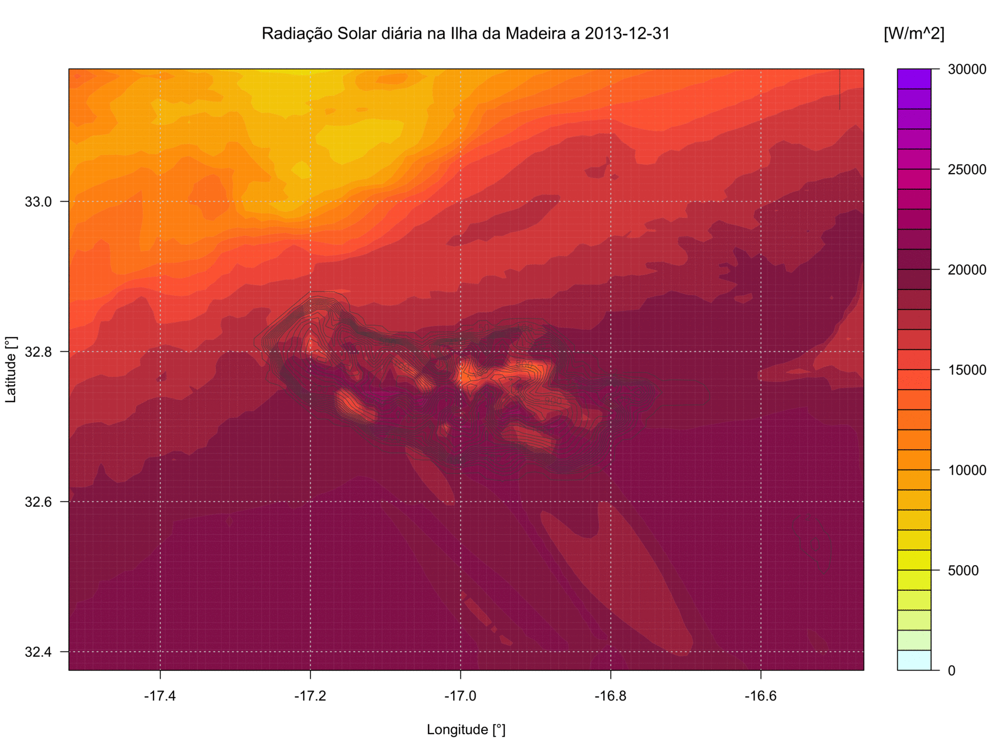

# ReSun & WRF output analysis
Creates .kmz (Google Earth) and .png with geographical data with the results of the ReSun & WRF simulations. Outputs graphs with median daily radiation for the simulated area.
This tool is used to have a critical analysis over the WRF & ReSun results, to study the potencial Solar Energy of that particular area.

Work in progress!!!

## Results:

**High quality image (png) example**

* Global horizontal radiation


**Google Earth (kmz) example**

* Global horizontal radiation


**Animations (GIF) example**

* Global horizontal radiation


## Usage:

* Run:
```r
make run
```

* kill application:
```r
make kill
```

Contacts:

<ricardo88faria@gmail.com>
